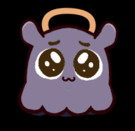

# ascii-logo-cube

A rotating 3D **ASCII cube** that wears a logo on every face — rendered as a fine dot-matrix of text characters, right in the browser. No libraries, no build step, no dependencies. Just open the HTML file.

> **Inspired by** the rotating ASCII cube on the [GitHub Shop](https://thegithubshop.com/products/mona-drink-float) (the *Mona Drink Float* product). This is a from-scratch recreation of that effect — all the rendering math is original.

<!-- Tip: a screenshot or GIF of the spinning cube would look great here too. -->

## Files

| File | What it is |
|------|------------|
| **`index.html`** | The showcase cube with three built-in logos — **Claude**, **OpenAI**, and a **cute** mascot — each with its own color theme. Everything (logo art + colors) is embedded, so the file is fully self-contained. |
| **`upload.html`** | A general version: **drop in any logo image** (PNG / JPG / SVG / WebP) and it samples the logo's shape *and* its dominant color, then paints them onto the cube. |

## Controls

- **Drag** anywhere to rotate (trackball-style, with release momentum)
- **Arrow keys** to rotate
- **Space** to toggle auto-spin
- **R** to reset the view
- **Size** slider to scale the cube
- In `index.html`: switch logos with the **Claude / OpenAI / Cute** toggle
- In `upload.html`: **Upload** button or drag-and-drop, plus an **Auto / Light / Dark** theme toggle

## How it works

- Each cube face is sampled in 3D, projected with simple perspective, and drawn into a character buffer with a z-buffer for correct occlusion.
- The surface is rendered as `.` dots; the logo is rendered as `#`. Cells are sized so glyphs never overlap, giving the clean dot-matrix look.
- Orientation is kept as a 3×3 rotation matrix (re-orthonormalized each frame) so dragging feels like a real trackball in any direction.
- Logos are rasterized to an offscreen canvas — vector marks via `Path2D`, raster images via the image itself — then sampled into the cube. Color logos keep their original colors; flat marks use a single brand color.

Pure HTML + CSS + vanilla JavaScript (Canvas 2D for logo rasterization). Runs offline.

## Source assets

The logo art lives in [`assets/`](assets/) (`claude.svg`, `openai.svg`, `cute-mascot.png`). Note that `index.html` already embeds these inline, so they're included here as references — you don't need them to run the cube.

## Note on logos

The Claude and OpenAI marks are trademarks of their respective owners and are included here only as demonstration content. The mascot is the author's own.
